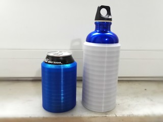
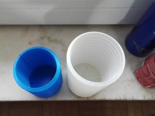
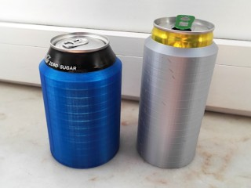
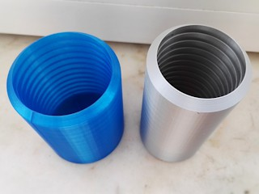

# High-tech Koozie (customizable)
*3D printable Customizable high-tech cooler (koozie) for cans and bottles (formerly thing:1771124 and thing:3927994)*

### License
[Creative Commons - Attribution - Non Commercial - Share Alike](https://creativecommons.org/licenses/by-nc-sa/4.0/)

For the legally impaired: my interpretation of this license is that you cannot sell neither the 3D models generated by this customizer, nor physical 3D prints. Read the entire LICENSE file for the fine details.

### Gallery

[🔎](images/koozie1.jpg) [🔎](images/koozie2.jpg) [🔎](images/koozie3.jpg) [🔎](images/koozie4.jpg)

## Description and Instructions

OK, I admit, it's just a piece of plastic, therefore ‘high tech’ may be a bit exaggerated.
Still, this is not your average soda can cooler, or ‘koozie’ as it is sometimes called. This one has no inner shell, instead it relies on the can itself to seal the air inside. This has the benefit of minimizing the material needed hence lighter weight, as well as a minimal contact area with the plastic such that it maximally relies on air for insulation: air is a better thermal insulator than most if not all plastics. To further improve insulation, the zone between the can and the outer walls is divided into horizontal compartments to reduce convection.

This is a **customizable parametric model** made in OpenSCAD. A ready-to-print model for the ubiquitous 330 ml can can be found in the examples folder, but if you have a different size of can or bottle, just **[use OpenSCAD's Customizer](https://www.dr-lex.be/3d-printing/customizer.html)** to generate a model tailored to it. The only condition is that the bottle's lower part is a nearly perfect cylinder.

When creating your own model in Customizer, the most important parameters are the diameter of the can and its height you want to be covered by the koozie. To get a tight fit without having to push or tug on the can, make sure to either accurately measure the diameter, or just look it up in specification sheets from can or bottle manufacturers. The JSON file contains a few presets with accurate diameters that can be loaded in the customizer interface inside OpenSCAD.
The *air gap* determines the distance between the outside of the can/bottle (plus tolerance) and the outer wall. I usually set this to between 4 and 5 mm. More will obviously offer better insulation, but also makes the thing fatter and unwieldy.

This works equally well in rigid and flexible filaments. A flexible filament is recommended for robustness, for instance the koozie for the SIGG bottle in the photos was printed with rigid.ink flexible PLA.

Depending on what material you print in, to compensate for shrinkage of the material when it cools down after printing, you may need to slightly scale up the model or generate it with either a larger tolerance or larger diameter. Flexible filaments tend to shrink considerably but since they're flexible, it usually also isn't too bad if the model is slightly too tight. To avoid spending hours and material on a print and then noticing it is too tight or sloppy, the customizer has an option `test_slice` that will generate a minimal model that can be quickly printed for testing the fit.
 

### Print settings

I print these at 0.2 mm layers, with the slicer set to 20% infill, with no raft and no supports. If you're using Slic3r/PrusaSlicer, I recommend turning off “detect thin walls.”

Despite its apparent complexity, this is an easy print because all overhangs are 45° and they are convex. Do not try to enable supports because it could only result in a terrible and unnecessary mess.

For an efficient print, match the extrusion width to the wall thickness(es) you have configured in customizer. Some slicers like PrusaSlicer will tell you the optimal wall widths for your current set of print settings. The example models were generated with thicknesses that should print with 2 perimeters on a 0.4 mm nozzle.

Infill is only relevant for the small outer ring at the bottom. You can use 100% infill for the strongest result, but normally you will want to use the lowest infill value possible.
 

### Does this really work?

I tested the difference between a 330 ml can inside this cooler compared to a bare can, both starting at 3°C in a room at 23°C. After one hour, the can in the cooler was at 10.4°C, the other one at 14.6°C. This was with the cooler starting out at room temperature. If you would refrigerate the koozie as well before using it, it would keep your drink cool for a slightly longer time.
 

## Updates

### 2018/07/01
Added a slight chamfer to the models to make the bottom edges less sharp, and provided ‘xBtm’ models with a thicker bottom.

### 2019/07/13
Added model for 250 ml energy drink cans.

### 2019/10/20
Made the model customizable, such that it is much easier to generate this kind of koozie for any (cylindrical) shape of can or bottle.

### 2019/11/13: v1.3
Avoid risk of non-manifold model (thanks to Lyl3 for reporting this).

## Tags
`customizer`, `openscad`, `beer`, `beer_can`, `cooler`, `Insulator`, `Koozie`, `soda`, `soda_can`, `thermos`, `bottle`
